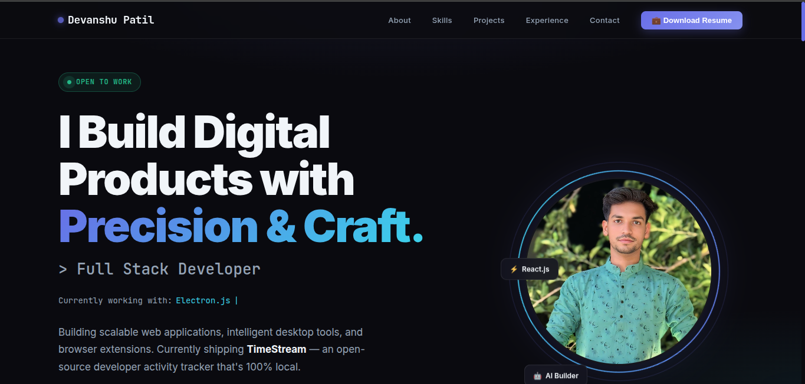

# Devanshu Patil — Personal Portfolio

Modern, responsive, and animated **personal portfolio website** built with **HTML, CSS, and Vanilla JavaScript** — no frameworks, just craft.

<p align="center">
  <a href="https://developer.mozilla.org/en-US/docs/Web/HTML"></a>
  <a href="https://developer.mozilla.org/en-US/docs/Web/CSS"></a>
  <a href="https://developer.mozilla.org/en-US/docs/Web/JavaScript"></a>
  <a href="https://www.emailjs.com/"></a>
  <a href="https://tagmanager.google.com/"></a>
  <a href="https://www.netlify.com/"></a>
</p>

---

## Preview



---

## Live Site

Deployed on **Netlify** — [devanshupatil.netlify.app](https://devanshupatil.netlify.app)

---

## Sections

| Section | Description |
|---------|-------------|
| **Hero** | Animated typing effect, profile photo with rotating ring, floating tech badges |
| **Stats Bar** | 4+ projects shipped, 7+ technologies, 100% privacy-first builds |
| **About** | Bio text + interactive terminal card UI |
| **Skills** | 6-category skill grid with animated progress bars |
| **Projects** | Featured project (TimeStream) + 3-column project grid |
| **Experience** | Vertical timeline — internships, freelance, education |
| **Contact** | Contact links + EmailJS-powered contact form |
| **Footer** | Nav links + copyright |

---

## Features

- **Typing animation** cycling through: React.js, Node.js, Spring Boot, Electron.js, PostgreSQL, Docker
- Glassmorphism **skill cards** with scroll-triggered bar animations
- **Featured project card** (TimeStream) with full-width image layout
- **Scroll reveal** animations on every section via IntersectionObserver
- Sticky **navbar** with blog and resume download links
- **Contact form** with EmailJS — client-side delivery, no backend needed
- **Google Tag Manager** analytics integration
- Fully **responsive** — desktop → tablet → mobile (hamburger nav hides at ≤600 px)
- Custom **scrollbar** styled with indigo accent

---

## Tech Stack

| Layer | Technologies |
|-------|-------------|
| Markup | HTML5 |
| Styling | CSS3 — CSS variables, glassmorphism, media queries |
| Logic | Vanilla JavaScript (ES6+) — no framework |
| Fonts | Inter · JetBrains Mono (Google Fonts) |
| Email | EmailJS (client-side form delivery) |
| Analytics | Google Tag Manager |
| Hosting | Netlify (root publish, no build step) |

---

## Projects Showcased

### Featured
- **TimeStream** — Open-source Electron desktop app that tracks developer activity (GitHub visits, YouTube tutorials, AI sessions) into a local SQLite database with a Chrome Extension. 100% local, zero cloud.
  - Stack: Electron · Node.js · SQLite · Chrome Extension · Vanilla JS · GitHub Actions

### Grid
- **Online Learning Platform** — Role-based dashboards, JWT auth, course management, attendance tracking, LLM-powered question extraction. Stack: React · Node.js · PostgreSQL · Docker · GCP
- **SagarShop E-commerce** — Full e-commerce platform with admin panel, product & order management, REST APIs. Stack: React · Node.js · Supabase
- **Marriage Biodata Builder** — Dynamic form with live preview and one-click PDF generation. Stack: HTML · CSS · JavaScript · jsPDF

---

## Project Structure

```text
.
├── index.html              # Main entry point (served by Netlify)
├── style.css               # Legacy stylesheet (pre-redesign)
├── script.js               # Legacy scripts (pre-redesign)
├── netlify.toml            # Netlify config — base & publish set to root
├── closeup.jpeg            # Profile photo
├── full_pic.jpeg           # Full photo
├── Devanshu Patil.pdf      # Resume (PDF)
├── Preview-website.png     # README screenshot
├── icons/                  # Tech stack icon assets
├── projectThumbnail/       # Project preview images
│   ├── timestream.png
│   ├── online-learning-patfrom.png
│   ├── shop-sagar.png
│   └── marriage-biodata.png
├── Netliffy/               # Netlify deploy mirror (kept in sync manually)
│   ├── index.html
│   ├── closeup.jpeg
│   ├── Devanshu Patil.pdf
│   └── projectThumbnail/
└── SPCL /                  # SPCL Infotech training assignment PDFs
```

---

## Getting Started (Local)

### Option A — Open directly

Open `index.html` in your browser (some EmailJS features need a server).

### Option B — Local server (recommended)

```bash
# Python
python3 -m http.server 5500

# Node
npx serve .
```

Then open `http://localhost:5500`.

---

## Configuration

### Typing effect words

In `index.html`, find the `words` array in the inline `<script>`:

```js
const words = ['React.js', 'Node.js', 'Spring Boot', 'Electron.js', 'PostgreSQL', 'Docker'];
```

### Theme / CSS variables

All design tokens are in the `:root` block inside `index.html`:

```css
:root {
  --bg: #0a0a0f;
  --surface: #111118;
  --indigo: #6366f1;
  --cyan: #22d3ee;
  --green: #10b981;
  --text: #f1f5f9;
  --muted: #94a3b8;
  --radius: 14px;
}
```

---

## Contact Form (EmailJS)

The form uses **EmailJS** for browser-side email delivery — no backend required.

### Where to update credentials

In `index.html` (bottom `<script>`):

```js
emailjs.init('YOUR_PUBLIC_KEY');               // Public key
emailjs.sendForm('YOUR_SERVICE_ID', 'YOUR_TEMPLATE_ID', this);
```

### Template params

```js
{ from_name, reply_to, message }
```

---

## Analytics (Google Tag Manager)

GTM is injected in the `<head>` and `<noscript>` of `index.html`. To swap the container:

1. Replace the GTM container ID (`GTM-XXXXXXX`) in both the `<head>` script and the `<noscript>` iframe.
2. Configure tags, triggers, and GA4 inside the GTM dashboard — no code changes needed.

---

## Deployment (Netlify)

`netlify.toml` is configured for a zero-build static site:

```toml
[build]
  base    = "."
  publish = "."
```

Push to `main` → Netlify auto-deploys from the root `index.html`.

The `Netliffy/` folder is a manual mirror kept in sync as a backup deploy target.

---

## Credits

Designed & built by **Devanshu Patil**.

- GitHub: [github.com/devanshupatil](https://github.com/devanshupatil)
- LinkedIn: [linkedin.com/in/devanshu-patil-973334266](https://www.linkedin.com/in/devanshu-patil-973334266)
- Blog: [blogbydevanshu.netlify.app](https://blogbydevanshu.netlify.app)
- Email: devanshupatil692@gmail.com

If you fork this repo, please consider giving credit by linking back.
